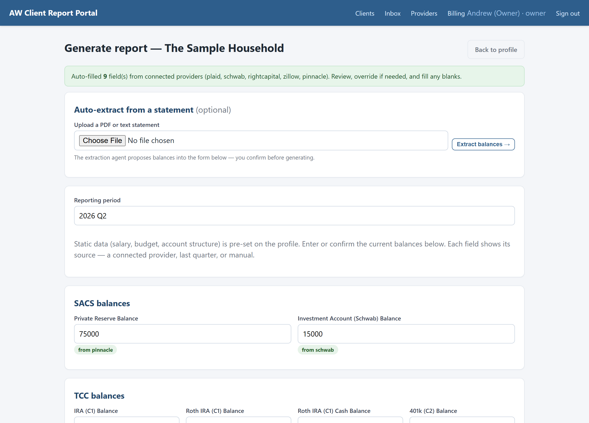
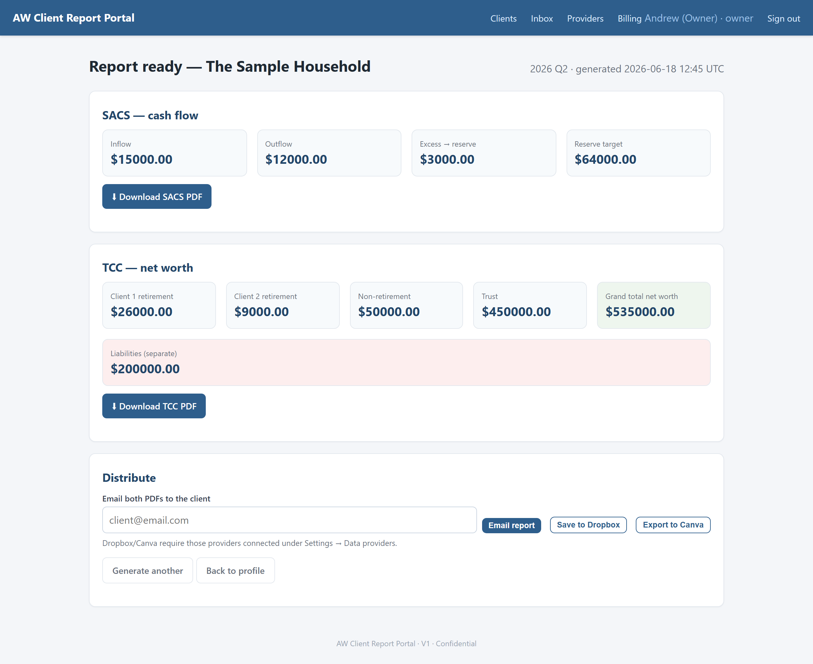
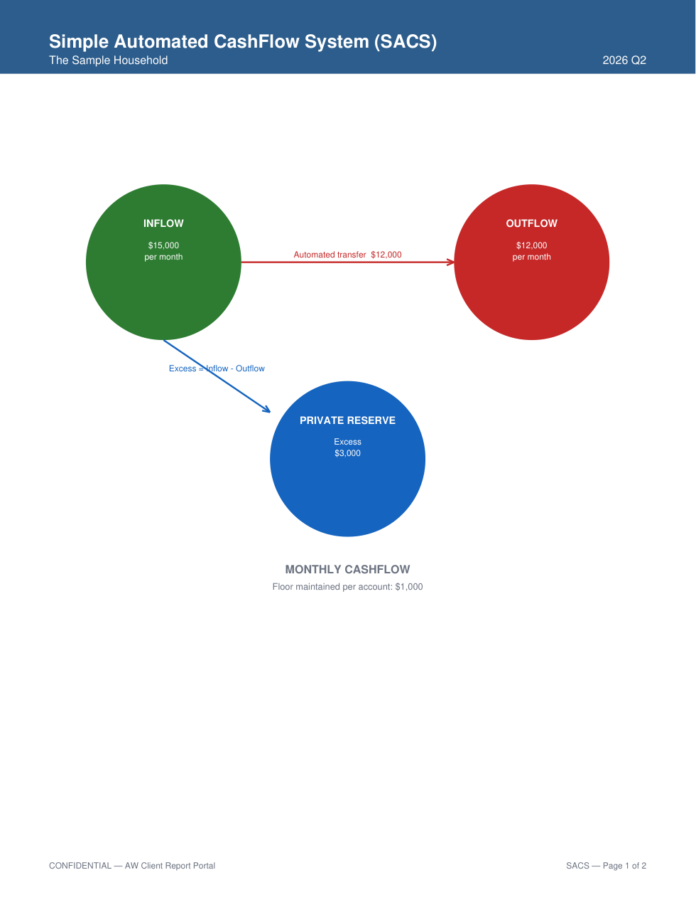
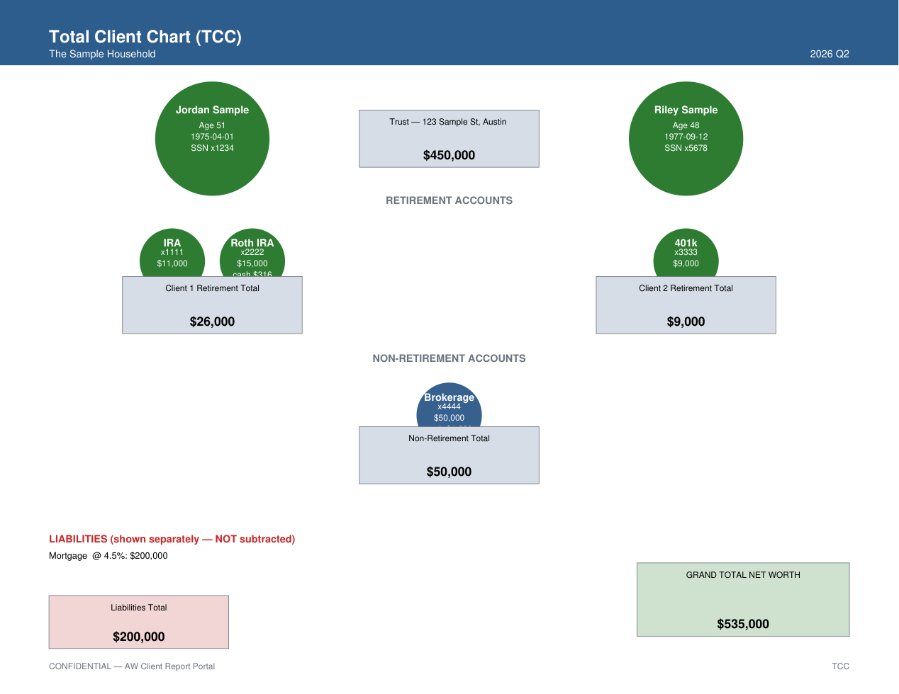

**English** · [Português](README.pt.md) 🇧🇷

# AW Client Report Portal
#### built by **Sagan**

# A full day of client-report prep — done in minutes. In your exact format.

Pull every balance from your banks and custodians **automatically**, let the system do **all the math**, and hand your client a polished **cash-flow** and **net-worth** report — with no Canva, no spreadsheets, no calculator, and no errors.

### ⏱️ A day → minutes  ·  ✅ Zero manual math  ·  🎯 Your templates, untouched  ·  🔒 Your data stays yours

---

## How it works

**1 · Open a client, hit *Generate* — the numbers fill themselves.**
The portal reaches into **Plaid, Schwab, RightCapital, Zillow and Pinnacle**, pulls the balances, and shows you **exactly where each number came from**. Anything it can't reach, it flags — so you never hunt for a figure again.



**2 · One click, and the math is done.**
Inflows, outflows, retirement, the trust, liabilities, net worth — **every total calculated and re-checked for you**.



**3 · Your reports, your format.**
Pixel-perfect **SACS** (cash-flow) and **TCC** (net-worth) PDFs — exactly the way Andrew built them. Download, email, or save to Dropbox.

| Cash-flow (SACS) | Net-worth (TCC) |
|:--:|:--:|
|  |  |

---

# 🚀 Try it on your computer — in about 5 minutes

> You only need **Python** installed first (it's free — [download it here](https://www.python.org/downloads/), version 3.10 or newer). Then follow the steps below, copying each block into a terminal/PowerShell window.

### Step 1 — Get the files
**[⬇️ Download the ZIP](https://github.com/bhengubv/sagan-aw-client-portal/archive/refs/heads/main.zip)** and unzip it, then open a terminal **inside that folder**.
*(Prefer git? `git clone https://github.com/bhengubv/sagan-aw-client-portal.git` then `cd sagan-aw-client-portal`.)*

### Step 2 — Install it (one time)
**Windows (PowerShell):**
```powershell
python -m venv .venv
.\.venv\Scripts\python.exe -m pip install -r requirements.txt
```
**Mac / Linux:**
```bash
python3 -m venv .venv
.venv/bin/python -m pip install -r requirements.txt
```

### Step 3 — Load the demo data
```powershell
.\.venv\Scripts\python.exe seed.py
```
*(Mac/Linux: `.venv/bin/python seed.py`)*

### Step 4 — Start it (two terminal windows, leave both open)
**Window 1** — the data service:
```powershell
.\.venv\Scripts\python.exe run_sandbox.py
```
**Window 2** — the portal:
```powershell
.\.venv\Scripts\python.exe run.py
```

### Step 5 — Open it
Go to **http://127.0.0.1:5000** in your browser and sign in:

| Email | Password |
|---|---|
| **owner@firm.test** | **changeme123** |

*(Other logins: `planner@firm.test`, `assistant@firm.test`, `superadmin@firm.test` for the admin view — all `changeme123`.)*

### Step 6 — See the magic
Open **The Sample Household → Generate report**. Watch the balances **fill in by themselves**, type the one remaining number, click **Generate**, and download your SACS & TCC reports. 🎉

> **Stuck?** Most common fix: if the balances don't auto-fill, make sure **Window 1 (`run_sandbox.py`) is still running**. Full troubleshooting → **[SETUP.md](SETUP.md)**.

---

## Why your team will love it

- **⏱️ A day becomes minutes.** Spend that time with clients, not in Canva.
- **✅ No more math errors.** Every figure is computed and cross-checked automatically.
- **🎯 Nothing changes for your clients.** Same reports, same format — just faster and flawless.
- **🔒 Secure by design.** Read-only access, your data stays yours, and **nothing is ever used to train an AI**.
- **📈 Grow without hiring.** Take on more clients without adding headcount.

## ▶️ See the 2-minute walkthrough

**[Watch the walkthrough](#)**  *(drop your Loom link here)*

---

## Under the hood

Built to the full Technical Specification — **all four phases, every element functional, 104 automated tests passing.**

- **Phase 1 — Portal core:** client management, the deterministic calculation engine, fixed-layout SACS & TCC PDFs, secure login with two-factor, audit log.
- **Phase 2 — Integrations:** an encrypted credential vault and read-only connectors for **Plaid, Schwab, RightCapital, Zillow, Pinnacle, PreciseFP** (+ Dropbox/Canva), with a built-in sandbox so it runs end-to-end before any real account is connected.
- **Phase 3 — AI & client-facing:** statement reading, anomaly flagging, automated client onboarding & reminders, an expense worksheet, and report distribution by email/Dropbox/Canva.
- **Phase 4 — Multi-firm platform:** self-serve sign-up, per-firm branding, usage billing, and an admin console.

**Run the tests:** `.\.venv\Scripts\python.exe -m pytest` (104 tests, ~40s).

### Going live (for the implementation team)

Local is a demo backed by a sandbox. To deploy it and connect **real** accounts, start with
**[docs/IMPLEMENTATION_HANDOFF.md](docs/IMPLEMENTATION_HANDOFF.md)** —
then [DEPLOYMENT.md](docs/DEPLOYMENT.md), [PROVIDERS.md](docs/PROVIDERS.md), and [OPERATIONS.md](docs/OPERATIONS.md).
Full local setup & troubleshooting is in **[SETUP.md](SETUP.md)**.
